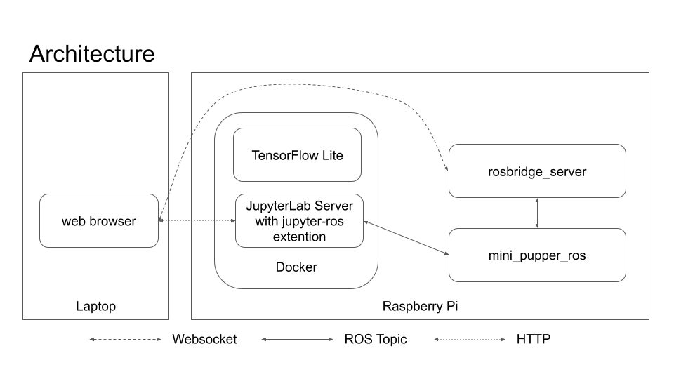

# mini-pupper-jupyter-notebooks

Jupyter Notebooks for [Mini Pupper](https://minipupperdocs.readthedocs.io/en/latest/index.html)

* Jupyter Notebooks to control Mini Pupper
* Dockerfiles to launch Jupyter Noteobooks with [RoboStack/jupyter-ros](https://github.com/RoboStack/jupyter-ros)

NOTE: **This project is under development and this is a draft version**.

| LiDAR Scan Visualization | Object Following |
| -- | -- |
|  |  |


## Requirements

* Mini Pupper
    * with Raspberry Pi 4
        * Ubuntu 20.04 required
        * ROS Noetic required
            * `ros-noetic-rosbridge-server`, `ros-noetic-tf2-web-republisher` is required for this project
        * 6GB or more free space in storage required (32GB SD-card recommended)
    * with LD06 LiDAR (optional)
    * with Camera (optional)
        * USB Web Camera and OAK-D-Lite are both OK
* Laptop
    * Google Chrome required (not tested on other browsers)
    * SSH Client

NOTE: ROS setup for laptop is not required for this tutorial

## Architecture



## Installation

### 1. Install Ubuntu 20.04 64bit version  

`ubuntu-20.04.5-preinstalled-server-arm64+raspi.img.xz` is recommended.

https://cdimage.ubuntu.com/releases/20.04/release/

### 2. Install Mini Pupper base package

Follow the official document.  
https://github.com/mangdangroboticsclub/mini_pupper_bsp

### 3. Install ROS packages

Install ROS.

```
git clone https://github.com/Tiryoh/ros_setup_scripts_ubuntu.git
cd ros_setup_scripts_ubuntu
./ros-noetic-ros-base.sh
```

Install ROS package for this project.

```
sudo apt install ros-noetic-rosbridge-server ros-noetic-tf2-web-republisher
```

Install ROS packages for Mini Pupper.  
Follow mini_pupper_ros official document.  
https://github.com/mangdangroboticsclub/mini_pupper_ros

__NOTE: ROS setup for laptop is not required for this project.__

### 4. Install docker

```sh
sudo apt install docker.io
sudo usermod -aG docker $USER
```

If you need the latest docker, follow the official document.  
https://docs.docker.com/engine/install/ubuntu/#install-using-the-convenience-script

### 5. Prepare this project

Download this project with `git clone` command.

```sh
cd ~/dev/
git clone https://github.com/Tiryoh/mini-pupper-jupyter-notebooks.git
```

### 6. Prepare docker image

There are 2 ways to prepare docker image.  
Using pre-built image is easier.

A. Download the pre-built image (recommended)

```sh
docker pull ghcr.io/tiryoh/conda-jupyter-ros:noetic
```

B. Build docker image (optional)

```sh
cd ~/dev/mini-pupper-jupyter-notebooks/docker/conda-jupyter-ros
./build.sh
```

## Usage

Login Mini Pupper's Raspberry Pi via SSH and run `run.sh`.  

```sh
cd ~/dev/mini-pupper-jupyter-notebooks
./run.sh
```

After starting the `run.sh`, it shows JupyterLab token.
Access `$IP_ADDRESS:8888` from the laptop via web browser and input the token.  
For example, if the IP address of the Raspberry Pi is `192.168.10.12`, access `http://192.168.10.12:8888`.


https://user-images.githubusercontent.com/3256629/194112549-93bed843-8e7b-44ef-b889-a5450f87e2b0.mp4

## License

MIT License
